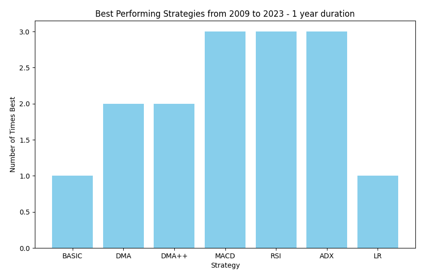
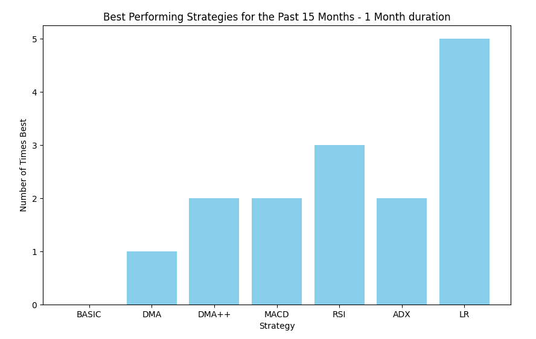

# trading-strategies 
### Vedant Talegaonkar - 2022CS11603
### Priyanshu Agrawal - 2022CS11641

# Optimisations

1. In all momemtum-based strategies, wherever there was a need of the data for the past n days, we have performed optimisations on the complexity of the algorithm, which made it *O(n)* from *O(n^2)*.
We stored either a running-variable/prefix-vector, which we updated at every step in constant time, thereby giving us *O(1)* complexity on every iteration/date.
2. In Linear Regression, due to floating-point inconsistencies in the Gaussian elimination method to find inverse of a matrix, we used the Adjoint method to calculate the inverse. This minimised the floating-point errors, leading to good predictions, particularly for short durations.
3. **We observed that fetching data from *jugaad-data* library led to duplicates in the data collected. We took care of this in the python code, which was a crucial step to be taken.** 

# Observations/Insights

We ran some testcases over the past few years/months and obtained some insight into the effectiveness of each of the strategies.

We first ran Best of All over the past 15 years, with 1 year duration at a time. The performance of strategies is as follows-

As we can see, MACD, RSI and ADX performed relatively better in the long-run i.e. 1 year duration.

Then, we ran Best of All over the past 15 months, with 1 month duration at a time. The performance of strategies is as follows-

Linear Regression performed the best over a short time duration (1 month).

Our inferences -
1. The **BASIC** strategy is a very naive approach to trading. It requires that the stock changes monotonically for n days (n=7 here), which is a highly unlikely scenario, given the high unpredictability of the market. Therefore, this strategy leads to minimal trading, which in general means worse performance.
2. **Linear Regression** performed significantly well for short time duration. This indicates that this strategy performs well for stocks with comparatively less variation (since short duration does not allow for much variation). 
3. The algorithm for **DMA++**, with the values of c1 = 2 and c2 = 0.2, performed in a highly unstable manner. This was because the absolute value of the Smoothing Factor (SF) was exceeding 1, which will lead to a blow up in the value of AMA. With the correct values of c1 and c2, our implementation will give the correct output.
4. We infer that **MACD**, **RSI** and **ADX** are good strategies in the long-term, and this is due to their stable and simple-to-describe behaviour.

# Part 4.1 - Pairs with Stop-Loss

We have explained my strategy with respect to what is happening to S1 for ease of understanding.

## Our Understanding/ Assumptions  : 
1. Our strategy works/ we can make a resonable prediction when abs(zscore) less than abs(stop_loss_threshold). 
2. Our "resonable prediction"/"motivation for the trade" is that abs(zscore) should return to 0. buy
3. Say today's zscore is > threshold we can say that if we generate a sell signal then we can be in profit in the future. 
4. But if today's zscore is > stop_loss_threshold too then we are not sure about the behaviour of the stock therefore we do not generate a signal.
5. Now in generating a sell signal if we have open buy positions (i.e we have bought the stocks of S1) then we clear of the oldest bought position with our todays sell signal. else we add this signal among our open sell positions.
6. After this has been done, we clear off all the old positions that are behaving unexpectedly (i.e their abs(zscore) is greater than abs(stop_loss_threshold)).
7. There are certain edge cases that have also been handled here. Say my porfolio is -x right now (i.e x stocks of S1 have been sold/shorted) then if we are getting a sell signal today according to the zscore then we "can" move forward with it provided we know that certain old sell positions need to be cleared off today thereby making room for today's sell.
